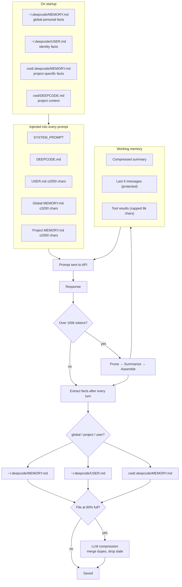

# DeepCode

Free AI in your terminal. 34 models, no account, no API key, no limits.

```
  ██████╗ ███████╗███████╗██████╗      ██████╗ ██████╗ ██████╗ ███████╗
  ██╔══██╗██╔════╝██╔════╝██╔══██╗    ██╔════╝██╔═══██╗██╔══██╗██╔════╝
  ██║  ██║█████╗  █████╗  ██████╔╝    ██║     ██║   ██║██║  ██║█████╗
  ██║  ██║██╔══╝  ██╔══╝  ██╔═══╝     ██║     ██║   ██║██║  ██║██╔══╝
  ██████╔╝███████╗███████╗██║         ╚██████╗╚██████╔╝██████╔╝███████╗
  ╚═════╝ ╚══════╝╚══════╝╚═╝          ╚═════╝ ╚═════╝ ╚═════╝ ╚══════╝
```

## Install 

Windows:

1. Download `deepcode.exe` and `install.bat` from [Releases](https://github.com/Schnickenpick/DeepCodev2/releases)
2. Put both files in the same folder
3. Right-click `install.bat` → Run as Administrator
4. Open a new terminal and type `deepcode`

Linux:

1. clone repo  "git clone https://github.com/Schnickenpick/DeepCodev2.git"
2. if not installed: install python and pip 
3. run "build.sh"
3. run "install.sh"
4. add ~/.local/bin to PATH
5. run deepcode by typing "deepcode"

## Features

**34 models** — GPT-4o, Claude Opus, Gemini 2.5 Pro, Llama, Mistral, and more. Switch anytime with `/model`.

**Agent mode** — AI that can read and write files, run shell commands, and search your codebase to complete tasks autonomously. Toggle with `/agent`.

**Web search** — answers pulled live from the internet with sources. Toggle with `/search`.

**Merge AI** — sends your prompt to GPT, Claude, and Gemini simultaneously and combines the best answer. Toggle with `/merge`.

**Reasoning mode** — multi-step self-reflection before answering. AI thinks, critiques itself, plans, then executes. Levels: `low`, `middle`, `high`, `ultra`. Toggle with `/reasoning <level>`.

**DEEPCODE.md** — project-aware context. Run `/init` in any project folder to generate a file that gets injected into every prompt automatically.

**Memory** — remembers facts about you and your projects across sessions.

**Session history** — resume past conversations with `/session`.

**Bell notifications** — get a terminal bell when a response finishes. Toggle with `/notify`.

## Commands

| Command | Description |
|---|---|
| `/model <name>` | Switch model — e.g. `/model opus` |
| `/models` | List all 34 models |
| `/agent` | Toggle agent mode |
| `/merge` | Toggle Merge AI |
| `/search` | Toggle web search |
| `/session` | Browse and resume past conversations |
| `/new` | Start a new conversation |
| `/compact` | Summarize conversation to save context |
| `/reasoning <level>` | Set reasoning — off/low/middle/high/ultra |
| `/init [hint]` | Generate DEEPCODE.md for this project |
| `/notify` | Toggle bell notification on/off |
| `/memory` | Show remembered facts |
| `/clear` | Clear the screen |
| `/help` | Show all commands |
| `/exit` | Quit |

## Keybinds

| Key | Action |
|---|---|
| `Enter` | Send message |
| `Ctrl+J` | New line (multiline input) |
| `Tab` | Autocomplete command |
| `↑ / ↓` | Navigate history / autocomplete |
| `Ctrl+C` | Cancel / exit |

## Build from source

Requires Python 3.9+.

```
pip install httpx rich prompt_toolkit tiktoken
pip install -e .
deepcode
```

To build the exe:

```
pip install pyinstaller appdirs
python -m PyInstaller deepcode.spec --clean
```

## Antivirus False Positives

Some antivirus tools flag `deepcode.exe`. These are false positives caused by PyInstaller, not malicious code.

**Why it happens:** PyInstaller bundles Python, all dependencies, and your code into a single `.exe`. The bootloader that unpacks everything at runtime looks similar to self-extracting malware to heuristic scanners — even when the code inside is completely clean.

**Specific flags explained:**

- **Software Packing** — PyInstaller compresses everything into one file. Every PyInstaller exe gets this flag.
- **QueryPerformanceCounter** — PyInstaller's bootloader uses this for timing during startup. Not VM detection, standard bootloader behavior.
- **Persistence / Privilege Escalation** — `install.bat` writes to the registry to add the install folder to PATH. That's all. Any installer does this.
- **vcruntime140.dll** — PyInstaller ships its own copy of the C++ runtime. Normal, not sideloading.
- **Bkav Pro / SecureAge flagging** — both are known for false positives on any PyInstaller binary. 67/69 vendors on VirusTotal say clean, including Windows Defender, Bitdefender, CrowdStrike, and Kaspersky.

**Verify it yourself:** The full source code is in this repo. Build it from source using the instructions above and you'll get the same exe with the same flags — because they come from PyInstaller, not the code.

## How Memory Works

DeepCode remembers things about you and your projects across sessions — and stays fast even after months of use.

### Three memory stores

| File | What goes in it | Where |
|---|---|---|
| `MEMORY.md` | Personal preferences, general habits | `~/.deepcode/MEMORY.md` |
| `USER.md` | Identity facts — name, job, skills | `~/.deepcode/USER.md` |
| `MEMORY.md` (project) | Facts specific to the current project | `<your project>/.deepcode/MEMORY.md` |

After every response, a fast background call extracts new facts from the conversation and routes them to the right file. Project-specific details (e.g. "prefers pixel art for this game") stay local to that project. Personal preferences (e.g. "prefers spaces over tabs") go global.

Each file has a size cap. When a file hits 80% full, a compression pass runs automatically — duplicates get merged, stale facts get dropped, and the file stays lean.

### Context window management

Every message sends the full conversation history to the AI. Long sessions with big file writes can push this into the hundreds of thousands of tokens. DeepCode manages this with a multi-phase compressor:

1. **Prune** — old tool outputs replaced with placeholders (free, no AI needed)
2. **Summarize** — AI writes a structured summary of the middle of the conversation (goals, decisions, progress, next steps)
3. **Assemble** — summary + last 6 messages kept; everything else discarded

The compressor fires when the prompt hits 75% of the 133k token budget. Summaries are updated incrementally — each compression builds on the previous one rather than starting fresh, so context accumulates instead of degrading.

### Diagram



## License

MIT
